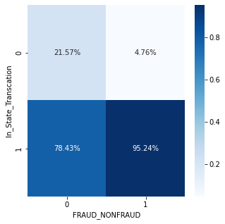
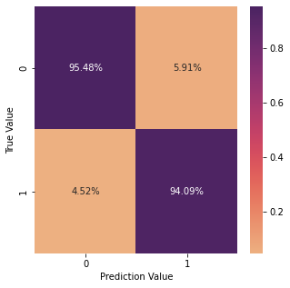
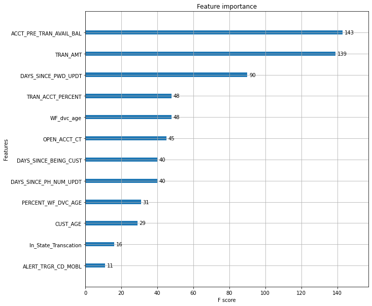
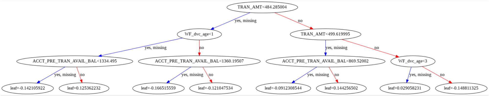
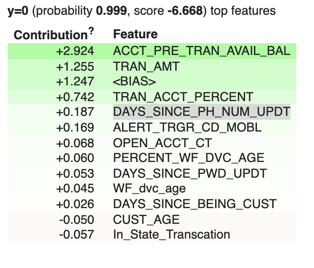
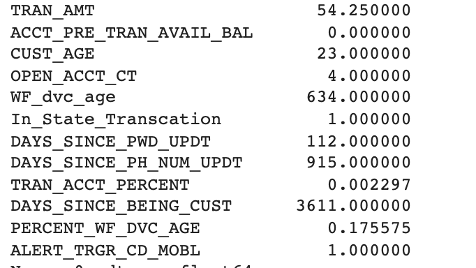
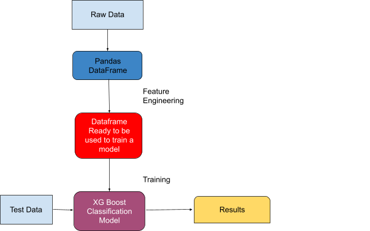

@import url('https://themes.googleusercontent.com/fonts/css?kit=dpiI8CyVsrzWsJLBFKehGpLhv3qFjX7dUn1mYxfCXhI');ol{margin:0;padding:0}table td,table th{padding:0}.c19{margin-left:-0.8pt;padding-top:10pt;padding-bottom:0pt;line-height:1.4;orphans:2;widows:2;text-align:center}.c4{color:#000000;font-weight:400;text-decoration:none;vertical-align:baseline;font-size:16pt;font-family:"Roboto";font-style:normal}.c3{margin-left:-72pt;padding-top:10pt;padding-bottom:80pt;line-height:1.0;orphans:2;widows:2;text-align:left}.c5{margin-left:-0.8pt;padding-top:40pt;padding-bottom:0pt;line-height:1.4;orphans:2;widows:2;text-align:left}.c12{color:#666666;font-weight:400;text-decoration:none;vertical-align:baseline;font-size:10pt;font-family:"Roboto";font-style:normal}.c6{margin-left:-0.8pt;padding-top:24pt;padding-bottom:0pt;line-height:1.0;orphans:2;widows:2;text-align:left}.c0{margin-left:-0.8pt;padding-top:10pt;padding-bottom:0pt;line-height:1.4;orphans:2;widows:2;text-align:left}.c1{color:#666666;font-weight:400;text-decoration:none;vertical-align:baseline;font-size:11pt;font-family:"Roboto";font-style:normal}.c8{margin-left:-0.8pt;padding-top:10pt;padding-bottom:0pt;line-height:1.0;orphans:2;widows:2;text-align:left}.c9{margin-left:-0.8pt;padding-top:20pt;padding-bottom:0pt;line-height:1.0;orphans:2;widows:2;text-align:left}.c17{color:#283592;font-weight:400;text-decoration:none;vertical-align:baseline;font-size:34pt;font-family:"Roboto";font-style:normal}.c16{color:#e01b84;font-weight:400;text-decoration:none;vertical-align:baseline;font-size:11pt;font-family:"Roboto";font-style:normal}.c13{color:#e01b84;font-weight:400;text-decoration:none;vertical-align:baseline;font-size:12pt;font-family:"Roboto";font-style:normal}.c10{color:#000000;text-decoration:none;vertical-align:baseline;font-size:21pt;font-family:"Roboto";font-style:normal}.c14{text-decoration-skip-ink:none;-webkit-text-decoration-skip:none;color:#1155cc;text-decoration:underline}.c11{background-color:#ffffff;max-width:468pt;padding:54pt 72pt 54pt 72pt}.c15{color:inherit;text-decoration:inherit}.c7{height:11pt}.c2{font-weight:700}.c18{height:21pt}.title{padding-top:20pt;color:#283592;font-size:34pt;padding-bottom:0pt;font-family:"Roboto";line-height:1.0;orphans:2;widows:2;text-align:left}.subtitle{padding-top:10pt;color:#e01b84;font-size:11pt;padding-bottom:0pt;font-family:"Roboto";line-height:1.4;orphans:2;widows:2;text-align:left}li{color:#666666;font-size:11pt;font-family:"Roboto"}p{margin:0;color:#666666;font-size:11pt;font-family:"Roboto"}h1{padding-top:24pt;color:#000000;font-size:21pt;padding-bottom:0pt;font-family:"Roboto";line-height:1.0;orphans:2;widows:2;text-align:left}h2{padding-top:10pt;color:#000000;font-size:16pt;padding-bottom:0pt;font-family:"Roboto";line-height:1.0;orphans:2;widows:2;text-align:left}h3{padding-top:10pt;color:#e01b84;font-weight:700;font-size:12pt;padding-bottom:0pt;font-family:"Roboto";line-height:1.0;orphans:2;widows:2;text-align:left}h4{padding-top:0pt;color:#6d64e8;font-weight:700;font-size:20pt;padding-bottom:0pt;font-family:"Roboto";line-height:1.4;page-break-after:avoid;orphans:2;widows:2;text-align:left}h5{padding-top:8pt;color:#666666;font-size:11pt;padding-bottom:0pt;font-family:"Trebuchet MS";line-height:1.4;page-break-after:avoid;orphans:2;widows:2;text-align:left}h6{padding-top:8pt;color:#666666;font-size:11pt;padding-bottom:0pt;font-family:"Trebuchet MS";line-height:1.4;page-break-after:avoid;font-style:italic;orphans:2;widows:2;text-align:left}

Wells Fargo Campus Analytics Challenge 2021: Machine Learning Model to Predict Suspected Elder Fraud

October 11, 2021 | Mark Del Grande

Link to code: [https://github.com/Mark-DelGrande/Wells-Fargo-Campus-Analytics-Challenge/blob/main/WellsFargoCampusAnalyticsChallenge.ipynb](https://www.google.com/url?q=https://github.com/Mark-DelGrande/Wells-Fargo-Campus-Analytics-Challenge/blob/main/WellsFargoCampusAnalyticsChallenge.ipynb&sa=D&source=editors&ust=1633999196324000&usg=AOvVaw3ucpWhTMIKugtgJGr5AjSZ)

Feature Engineering
===================

The first step in making a model was to understand what all of the data represented. After examining the data, I had a few initial thoughts about what useful features I could create from the data and which pre-existing feature would be important. Here they are:

Is this an in-state transaction?
--------------------------------

For this feature, I standardized all the values in both the STATE\_PRVNC\_TXT and CUST\_STATE columns. I then compared the two to see if they were the same and then converted it to binary 1 for in-state and 0 for out of state. As you can see from the confusion matrix on the left, there is some level of correlation between being an in-state transaction and a fraudulent transaction.

Customer Age
------------

Clearly, since this whole competition was based around elder fraud, I knew from the very beginning this was going to be an important feature.

Days Between Transaction and Last Account Update
------------------------------------------------

My thoughts with this feature were that people may have had their account updated without them knowing so there could be a link between a recent password or phone number update with the account and a fraudulent transaction. For this, I made two features called DAYS\_SINCE\_PWD\_UPDT and DAYS\_SINCE\_PH\_NUM\_UPDT.

Percentage of Account the Transaction is For
--------------------------------------------

Next, I wanted to look at what percentage of the account was being withdrawn. For example, I would think that if the entire account balance was being withdrawn in one transaction that would raise some red flags. In addition to this, I use the TRAN\_AMT and ACCT\_PRE\_TRAN\_AVAIL\_BAL to understand how much money this percentage was worth.

Device Age Compared to Account Age
----------------------------------

Another feature I created was looking at how long the account had been open compared to how long this device had been associated with the account. This allowed me to see if an account had just been opened and that's why the device is new or if this device had just been added to a preexisting old account. A new device on an old account may be represented by a hacker adding a device to someone's account to make a fraudulent transaction.

One Hot Encoding
----------------

The last feature engineering I tried was one hot encoding on several of the categorical columns such as AUTHC\_PRIM\_TYPE\_CD, ALERT\_TRGR\_CD, DVC\_TYPE\_TXT, and AUTHC\_SCNDRY\_STAT\_TXT. I dropped all of these except for the ALERT\_TRGR\_CD encoding for MOBL since they had negligible impacts on the results and led to a more complicated model.

XG Boost Classification Model
=============================

Scores
------

Once the data was formatted and ready to be used, I started training an XG boost classification model. The data was split into 67% for training and 33% for testing. With the data split in this way, my model achieved an accuracy rate of 95.09%.

As you can see from the confusion matrix relative to data size, False positives happened 1.39% more than False Negatives. This is ideal because we would rather accidentally think a case is fraudulent and then follow up and find out that it is not fraud than have a truly fraudulent case go completely unnoticed.

The F1 score was 0.9152035861038477 with binary averaging since the problem had us classify the data into 0 (NonFraud) or 1(Fraud).

Feature Importance
------------------

Here is the importance of all the features. In my final model, I found that these 12 features were the most beneficial to my predictions. Therefore, I dropped all other features I had made to keep the model relatively simple and still have accurate results.

Above is what the first tree plot looked like once the XG boost classification model was trained.

Example Prediction 
-----------------------------------------

Lastly, here is an example of a test prediction. The top table shows the data that was inputted into the model and the bottom table shows the score given to this data and the reasoning behind the score. It scored a \-6.688, which means that the model was 99.9% sure that this was not a fraudulent transaction.

Flow Chart
==========

